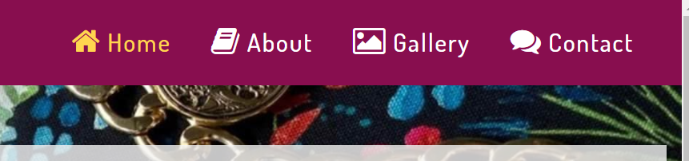
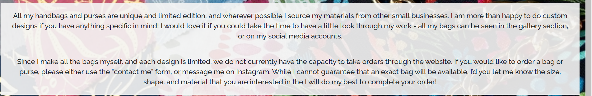
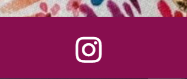
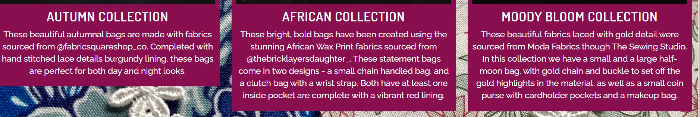
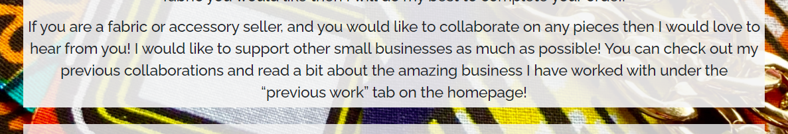
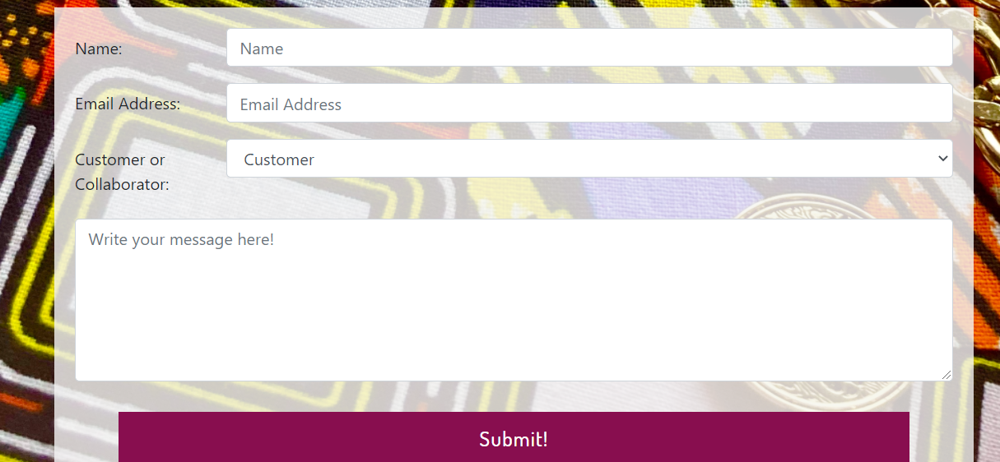

# Caragh Creates

User Centric Frontend Development Milestone Project - Code Institute.

A link to the live site can be found [here](https://robknowles248.github.io/Caragh-Creates-Website/).

For this project I have created a website for the independent sewing business "Caragh Creates". The website will provide the user with information about the business, details of the products available and a way to get in contact with the business owner.
 
## UX
 
### Project goals

The primary goal of Caragh Creates is to provide an intuitive and aesthetic website for the sewing business to engage customers and encourage sales. The website will have two target audiences: potential customers and potential collaborators (who may provide materials to the business owner).

#### Developer goals

The goal for the developer is to gain experience using HTML5, CSS and frameworks such as Bootstrap to create a static website fully serving the business goals and focusing on good user experience.

#### Business goals

The goal for the developer is to have a platform which enables easy running of the business and encourages as many sales as possible while increasing exposure of the business to many potential customers and collaborators.

#### User Stories

As a potential customer, I want:

1. Large clear images of products so that I can decide whether I want to buy them.

2. Intuitive website layout so I can easily navigate to the sections of the website I want to view.

3. Clear information on who the business owner is and about the products she makes so I can decide whether I want to buy from her.

4. Clear directions over how to purchase the products so that I know exactly how to go about buying a product.

5. Obvious links to social media so I can look at previous products.

As a potential collaborator (materials provider), I want:

1. Clear information on the business owner so I can make an informed choice as to whether they would be a good partner.

2. Information about previous collaborators so I can decide if I would be a suitable fit.

3. Intuitive contact form so that I can easily get in touch with the business owner.

### Design Choices

The maroon and yellow primary and secondary colours, plus the full page colourful patchwork backgrounds, were used to create an engaging, colourful and vibrant page that captures the user's attention.

### Wireframes

- [Site map](assets/wireframes/site_map.pdf)
- [Home page](assets/wireframes/home_page.pdf)
- [About page](assets/wireframes/about_page.pdf)
- [Gallery page](assets/wireframes/gallery_page.pdf)
- [Contact page](assets/wireframes/contact_page.pdf)

## Features
 
### Existing Features

- I have used Bootstrap carousels on `gallery.html` to allow the user to view multiple different types of bag in the same collection without taking up very much space on the page.

### Features Left to Implement

- I would like to add a feature to the gallery page that enable the user to see which bags are in stock and out of stock.

## Technologies Used

- [HTML5](https://en.wikipedia.org/wiki/HTML#:~:text=Hypertext%20Markup%20Language%20(HTML)%20is,scripting%20languages%20such%20as%20JavaScript.)
- [CSS3](https://en.wikipedia.org/wiki/CSS)
- [Bootstrap4](https://getbootstrap.com/)

## Testing

In this section, you need to convince the assessor that you have conducted enough testing to legitimately believe that the site works well. Essentially, in this part you will want to go over all of your user stories from the UX section and ensure that they all work as intended, with the project providing an easy and straightforward way for the users to achieve their goals.

Whenever it is feasible, prefer to automate your tests, and if you've done so, provide a brief explanation of your approach, link to the test file(s) and explain how to run them.

For any scenarios that have not been automated, test the user stories manually and provide as much detail as is relevant. A particularly useful form for describing your testing process is via scenarios, such as:

1. Testing the contact form:
    1. Went to the "Contact Me" page.
    2. Tried to submit an empty form and an error came up.
    
    3. Tried to submit the form with an invalid email address and an error message appeared.
    
    4. Tried to submit the form with all inputs valid and was brought to the expected form dump page.
    

2. All links open in a new tab using the `target="_blank"` attribute on their `a` tags.

3. Tested all html and css code with the [W3C Markup Validation Service](https://validator.w3.org/) and received no errors.

In addition, you should mention in this section how your project looks and works on different browsers and screen sizes.

### Bugs discovered

1. ### `navbar-dark` class overriding personal color styles used in my header

    - The color style rules I was using for the text colors normally and on hover were being overrided by the styles given in the `navbar-dark` class.
    - This was because I was styling them as `a` elements as a child of the `nav-item` class as shown below:

    

    - I solved this by using chrome developer tools to work out exactly which chain of bootstrap classes were setting the styling and overriding that styling:

    

## Deployment

This page was deployed on GitHub pages using the master branch and will automatically update upon any new commits to the master branch.

In order to replicate the process on your own computer you can paste `git clone https://github.com/RobKnowles248/Caragh-Creates-Website.git` into the command panel of any code editor and use `git remote rm origin` to cut ties with the original GitHub repository. You can then push this code to GitHub using `git push` making sure that the home page is called `index.html`. To deploy onto GitHub pages you go onto the setting tab of the repository and scroll down to "GitHub Pages". You then choose your source as the master branch and click "save". A link to the deployed website should now appear.

## Credits

### Code

- Template code for the social links list in the footer was taken from the resume mini project in the User Centric Front End Development module.
- Template code for the carousels on gallery.html using Bootstrap classes was taken from the [Bootstrap documentation](https://getbootstrap.com/docs/4.0/components/carousel/) and was edited to suit the site needs.

### Content
- The main text on `index.html`, `about.html`, `gallery.html` and `contact.html` was written by Caragh Green.

### Media
- Some of the photos used in this site were taken by Caragh Green.
- All images were compressed using [tinypng.com](https://tinypng.com/)

### Acknowledgements

- I received inspiration for this project from Caragh Green and her new business Caragh Creates.